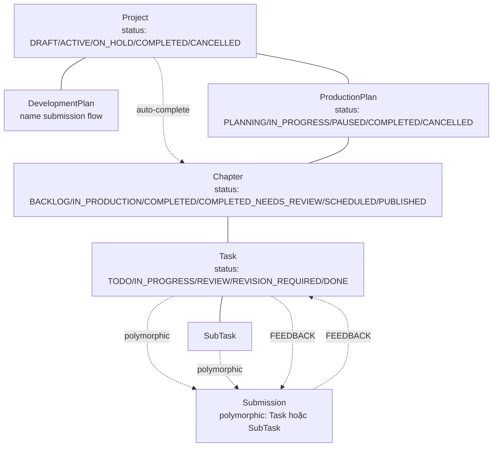
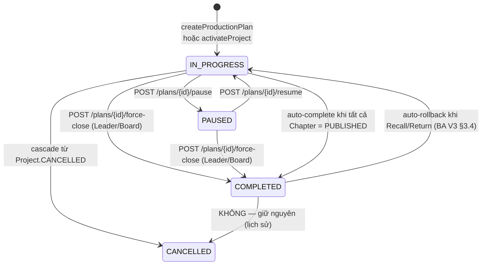
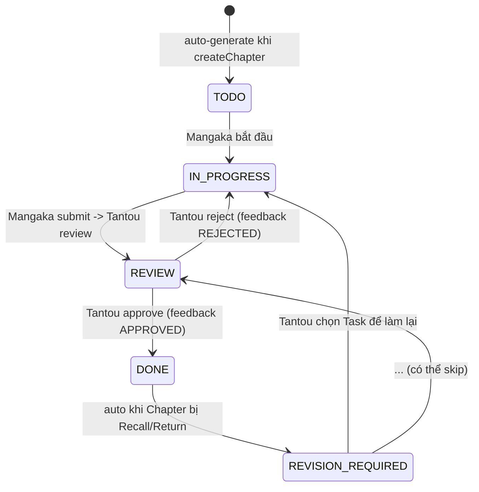

# SYSTEM_OVERVIEW — Phân tích tổng quan hệ thống Manga Publishing

> **Góc nhìn:** BA (Business Analyst) 3 năm kinh nghiệm.  
> **Đối tượng đọc:** Product Owner, Lead Dev, QA Lead, người mới onboard.  
> **Phạm vi:** toàn bộ codebase hiện tại (184 file main + 32 unit test), 3 sprint BA V3 đã code, loại trừ audit/log (theo yêu cầu stakeholder).
>
> **Phương pháp đọc:** đọc codebase (`/src/main`) + tài liệu BA V3 (`ba_production_publishing_gap.md`, `IMPLEMENTATION_ROADMAP.md`) + các file tổng hợp (`CHANGES.md`, `API_USAGE.md`, `TEST_RESULTS.md`). Đối chiếu giữa "yêu cầu" và "thực tế code".

---

## 0. Executive Summary (TL;DR)

**Hệ thống là gì:** một platform nội bộ cho phép Agile Studio quản lý vòng đời một manga từ lúc **đề xuất tên** → **lên kế hoạch sản xuất** → **tạo chapter → review → xuất bản → thu hồi/đóng**. Có 4 nhân vật chính (Tantou, Mangaka, Assistant, Board/Leader), mỗi nhân vật có vai riêng.

**Sau 3 sprint BA V3, hệ thống đang ở đâu:**

| Tiêu chí | Điểm | Diễn giải 1 dòng |
|---|:---:|---|
| Độ phủ Main Flow theo BA V3 | **~92%** | 11/12 gap đã cover; chỉ thiếu `SCHEDULED → PUBLISHED` scheduler (ngoài phạm vi) |
| Tính nhất quán nội tại (enum/thuật ngữ) | **8/10** | Đã chốt: Chapter dùng `IN_PRODUCTION`, Plan dùng `IN_PROGRESS`; migration đã chốt đường đi |
| Tính chặt chẽ rule biên | **7/10** | rejection cap, optimistic lock, cascade đều có; còn 4 điểm mơ hồ (xem §6) |
| Tính khả thi kỹ thuật | **8/10** | 32/32 unit test pass, build OK; nhưng thiếu integration test với H2 |
| Sẵn sàng đưa lên UAT | **6/10** | Cần smoke-test e2e trên browser trước khi ký off |
| **Tổng** | **~74/100** | Đủ dùng cho sprint demo; chưa đủ release production nếu thiếu audit/log |

**Một câu mô tả hệ thống (elevator pitch):**

> "Một Agile Studio nhỏ (1 Leader + 3 Board + vài Tantou/Mangaka/Assistant) vận hành theo quy trình tối giản: Board duyệt tên manga mới → Tantou kích hoạt Project → auto-tạo Plan `IN_PROGRESS` → Tantou tạo Chapter (auto-sinh 4 Task LINEART/INKING/BACKGROUND/NAME_WIP) → gán Mangaka → Mangaka cùng Assistant chạy vòng submission ROUGH→REVISION→FINAL → Tantou review → Leader/Board publish → nếu sai thì Recall/Return với quy trình bắt buộc ghi lý do."

---

## 1. Bản đồ hệ thống (System Map)

### 1.1. Domain Model — 6 entity chính



**Quan hệ 1–1 cứng:**

- `Project ↔ DevelopmentPlan` (1–1, nullable).
- `Project ↔ ProductionPlan` (1–1, `nullable=false unique=true`).

**Quan hệ 1–N:**

- `ProductionPlan → Chapter` (cascade ALL, orphanRemoval).
- `Chapter → Task` (cascade ALL, orphanRemoval).
- `Task → SubTask` (cascade ALL, orphanRemoval).
- `Submission → SubmissionFile` (cascade ALL).
- `Submission → Feedback` (cascade ALL).
- `Task → Feedback` (cascade ALL).

**Quan hệ nhiều-nhiều:**

- `Account ↔ SystemRole` (qua `@ManyToMany`).

**Quan hệ polymorphic đặc biệt (BA 3 năm đánh giá rất cao):**

`Submission` có 2 target nullable `Task`/`SubTask` (exactly-one, enforced bằng DB check constraint `CK_Submission_Polymorphic`). Đây là pattern **"polymorphic FK trong single-table"** — cho phép 1 bảng Submission phục vụ 2 luồng khác nhau mà không cần JOIN tới 2 bảng riêng. Đây là quyết định thiết kế thông minh: tiết kiệm bảng, vẫn có thể truy vấn `WHERE submission.task_id = ?` hoặc `WHERE submission.submittable_subtask_id = ?`.

### 1.2. Luồng nghiệp vụ (Top-Level Workflow)

```mermaid
sequenceDiagram
    participant M as Mangaka/Assistant
    participant T as Tantou
    participant B as Board Member
    participant L as Leader
    participant Sys as System

    Note over Sys: 0. Đề xuất tên (Name Submission)
    M->>Sys: POST /name/submit (name + tóm tắt)
    T->>Sys: POST /name/review/tantou (APPROVED/REJECTED + ghi chú)
    T->>Sys: POST /name/{id}/submit-to-board (chuyển cho Hội đồng)
    loop 3 Board
        B->>Sys: POST /name/review/board (vote)
    end
    Note over Sys: Nếu ≥ 2/3 APPROVED → Board tạo Project

    Note over Sys: 1. Project & Plan
    B->>Sys: POST /api/workflow/projects (gán Tantou)
    T->>Sys: PUT /api/workflow/projects/{id}/status (activate)
    Sys->>Sys: auto-tạo ProductionPlan với planStatus=IN_PROGRESS
    T->>Sys: POST /api/production-plans/{planId}/pause|resume|force-close

    Note over Sys: 2. Chapter & Task
    T->>Sys: POST /api/workflow/chapters (auto-sinh 4 Task)
    T->>Sys: POST /api/workflow/chapters/{id}/assign (gán Mangaka)

    Note over Sys: 3. Submission vòng submission
    M->>Sys: POST /api/submissions (Task/SubTask + files)
    T->>Sys: POST /api/workflow/tasks/{id}/feedback (APPROVED=DONE, REJECTED=IN_PROGRESS)

    Note over Sys: 4. Publish
    T->>Sys: PUT /api/workflow/chapters/{id}/status?status=COMPLETED
    B/L->>Sys: POST /api/workflow/chapters/{id}/publish (Board hoặc Leader)

    Note over Sys: 5. Quay ngược nếu sai
    B/L->>Sys: POST /api/workflow/chapters/{id}/return (≤2 lần; auto-trigger)
    L->>Sys: POST /api/workflow/chapters/{id}/override-return (lần 3)
    B/L->>Sys: POST /api/workflow/chapters/{id}/recall (sau khi publish)

    Note over Sys: 6. Hủy Project
    B/L->>Sys: POST /api/projects/{id}/cancel (cascade Plan)
```

**Phân tích:** Hệ thống này có **2 module lớn** chạy song song:

1. **Name Submission flow** (Module cũ, `MangaWorkflowController`): vòng vote 3 Board Member — phục vụ "Studio có nên làm manga này không".
2. **Production flow** (Module mới, `ProductionWorkflowController` + `ProductionPlanController`): vòng đời từ lúc Plan được duyệt đến khi Chapter `PUBLISHED`.

**Quan sát BA 3 năm:** Hai module giao tiếp với nhau rất ít — Module 1 ăn vào `Project.creation`, Module 2 ăn vào `Project.activation`. Tách biệt rõ nhưng **không có message queue**, **không có event-driven** — coupling rất chặt qua DB chung (`Project`, `Account`). Đây là quyết định OK cho sprint MVP nhưng nếu lên 100 user sẽ cần tách thành microservice.

---

## 2. Phân tích Actors & Quyền hạn (RBAC)

### 2.1. Vai diễn (Persona)

Codebase hiện tại có **6 role**, ánh xạ vào hệ Actor:

| Role | Persona | Phạm vi quyết định | Số user (thực tế trong studio) |
|---|---|---|---|
| `ADMIN` | System admin / Dev | Toàn quyền | 1–2 |
| `LEADER_BOARD` | Studio Leader | Quyết cuối cùng + override | 1 |
| `EDITORIAL_BOARD_MEMBER` | Board thành viên | Vote + publish/return/recall (single-signoff) | 3 (cố định theo design) |
| `TANTOU_EDITOR` | Biên tập viên phụ trách | Quản lý Plan/Chapter/Task/feedback | nhiều |
| `MANGAKA` | Họa sĩ chính | Làm Task, submit | nhiều |
| `ASSISTANT` | Trợ lý | Làm SubTask dưới quyền Mangaka | nhiều |
| `MANAGER` | Quản lý cấp cao | TBD (BA V3 chưa định nghĩa) | TBD |

**Quan sát BA 3 năm:**

- `LEADER_BOARD` và `EDITORIAL_BOARD_MEMBER` được phân quyền **gần như đối xứng** cho 3 action: **publish, return, recall, cancel project, force-close plan**. Sự khác biệt duy nhất là Leader được **override** lần 3 return.
- Đây là design theo kiểu **"Board multi-user + Leader tie-breaker"** — khá giống cơ chế Hội đồng quản trị doanh nghiệp: Board vote đa số, Leader giải quyết deadlock.
- Tuy nhiên, hệ thống **không thực sự có vote** ở publish/return/recall (single-signoff). Tức là 1 Board member bấm là đủ — thiếu "checks-and-balances". BA 3 năm sẽ flag: **cần quyết định xem có yêu cầu 2 Board ký ở action quan trọng không** (vd: Recall).

### 2.2. Bảng phân quyền chi tiết (tổng hợp từ code)

| Action | ADMIN | LEADER_BOARD | BOARD | TANTOU | MANGAKA | ASSISTANT |
|---|:---:|:---:|:---:|:---:|:---:|:---:|
| `POST /projects` (create) | ✅ | ❌ | ✅ | ❌ | ❌ | ❌ |
| `POST /projects/{id}/cancel` | ❌ | ✅ | ✅ | ❌ | ❌ | ❌ |
| `POST /projects/{id}/tantou` (assign Tantou) | ✅ | ❌ | ❌ | ✅ (là chính mình) | ❌ | ❌ |
| `PUT /workflow/projects/{id}/status` (activate) | ❌ | ❌ | ❌ | ✅ | ❌ | ❌ |
| `POST /production-plans/{id}/pause` | ❌ | ✅ | ✅ | ✅ | ❌ | ❌ |
| `POST /production-plans/{id}/resume` | ❌ | ✅ | ✅ | ✅ | ❌ | ❌ |
| `POST /production-plans/{id}/force-close` | ❌ | ✅ | ✅ | ❌ | ❌ | ❌ |
| `POST /workflow/chapters` | ❌ | ❌ | ❌ | ✅ | ❌ | ❌ |
| `POST /workflow/chapters/{id}/assign` | ❌ | ❌ | ❌ | ✅ | ❌ | ❌ |
| `PUT /workflow/chapters/{id}/status` | ❌ | ❌ | ❌ | ✅ | ❌ | ❌ |
| `PUT /workflow/tasks/{id}/status` | ❌ | ❌ | ❌ | ✅ | ✅ (của mình) | ✅ (của mình) |
| `POST /workflow/tasks/{id}/feedback` | ❌ | ❌ | ❌ | ✅ | ❌ | ❌ |
| `POST /workflow/chapters/{id}/publish` | ❌ | ✅ | ✅ | ❌ | ❌ | ❌ |
| `POST /workflow/chapters/{id}/return` | ❌ | ✅ | ✅ | ❌ | ❌ | ❌ |
| `POST /workflow/chapters/{id}/override-return` | ❌ | ✅ | ❌ | ❌ | ❌ | ❌ |
| `POST /workflow/chapters/{id}/recall` | ❌ | ✅ | ✅ | ❌ | ❌ | ❌ |
| `POST /submissions` (create) | ❌ | ❌ | ❌ | ✅ | ✅ | ✅ |
| `POST /submissions/{id}/review` (Feedback) | ❌ | ✅ | ✅ | ✅ | ❌ | ❌ |
| `POST /name/submit` | ✅ | ✅ | ❌ | ✅ | ✅ | ✅ |
| `POST /name/review/tantou` | ❌ | ❌ | ❌ | ✅ | ❌ | ❌ |

**Nhận xét BA 3 năm:**

- **Boards đa năng đến bất ngờ**: 1 Board member có thể 1 mình Recall một chapter đã public (làm mất 1000+ độc giả đang đọc). Cần quyết định có yêu cầu **2 Board ký** cho action nghiêm trọng (recall/cancel/force-close).
- **Assistant có quyền update Task status** — chỉ giới hạn là Task của mình. Đây là RBAC chi tiết tốt (`if (isAssistant && task.getAssignee().getId() != requester.getId()) throw AccessDenied`).
- **Tantou không thể publish** — đúng nguyên tắp "Tantou editorial, Board leadership". Tốt.
- **MANAGER role tồn tại nhưng không thấy sử dụng** trong bất kỳ controller nào. Có thể dead-code hoặc BA V3 chưa định nghĩa use case.

---

## 3. Phân tích State Machine

### 3.1. `ProductionPlan` — soft-terminal Plan



**Điểm mạnh (BA 3 năm đánh giá):**

- `COMPLETED` không phải terminal cứng — `recall` và `return` đều rollback `IN_PROGRESS`. Đây là điểm **rất Agile**: nhận ra rằng "đã xong" không có nghĩa là "không bao giờ sai".
- `pauseReason` lưu lý do + `pausedBy/At` cho traceability — vừa đủ.

**Điểm yếu (BA 3 năm flag):**

- `pauseReason` chỉ lưu **lần pause gần nhất** — không có lịch sử pause. Sau 5 lần pause/resume, BA không truy được "tháng 3 ai pause, lý do gì".  
  → **Khuyến nghị:** Sprint sau nên tạo bảng `PlanPauseHistory(planId, pausedBy, pausedAt, reason, resumedBy, resumedAt)`.
- `CANCELLED` được set khi Project bị cancel — nhưng nếu Plan **đã COMPLETED** thì giữ nguyên (test `planAlreadyCompletedUntouched`). Đây là quyết định có chủ ý tốt: **không phá lịch sử đã đóng**.

### 3.2. `Chapter` — 6 trạng thái (5+1 leo thang)

```mermaid
stateDiagram-v2
    [*] --> BACKLOG: createChapter
    BACKLOG --> IN_PRODUCTION: assignChapter<br/>(gán Mangaka)
    IN_PRODUCTION --> COMPLETED: Tantou bấm "Hoàn thành"<br/>PUT /chapters/{id}/status?status=COMPLETED
    COMPLETED --> PUBLISHED: Board/Leader publish<br/>POST /chapters/{id}/publish
    PUBLISHED --> IN_PRODUCTION: Board/Leader recall<br/>POST /chapters/{id}/recall
    COMPLETED --> IN_PRODUCTION: Board/Leader return (rejectionCount<2)<br/>POST /chapters/{id}/return
    IN_PRODUCTION --> COMPLETED: Tantou re-complete
    COMPLETED --> COMPLETED_NEEDS_REVIEW: Return khi rejectionCount>=2<br/>(khóa; buộc họp Board)
    COMPLETED_NEEDS_REVIEW --> IN_PRODUCTION: Leader override-return<br/>POST /chapters/{id}/override-return
    BACKLOG --> IN_PRODUCTION: auto sau khi assign
    COMPLETED --> SCHEDULED: (BA V3 §1.1 — chưa implement; thiếu scheduler)
    SCHEDULED --> PUBLISHED: (BA V3 §1.1 — chưa implement; thiếu scheduler)
```



**Điểm mạnh:**

- Có **explicit leo thang** `COMPLETED_NEEDS_REVIEW` — không bị stuck ở "đã trả 2 lần nhưng vẫn cứ trả".
- Optimistic locking `version:Long @Version` giải quyết race-condition ở publish/reject — cần thiết vì có 2 actor (Leader + Board) có thể cùng click.
- `rejectionCount` + `recallCount` cho phép "nhìn lại lịch sử 1 chapter".

**Điểm yếu / chưa chốt:**

- `SCHEDULED` đã thêm vào enum nhưng **chưa có endpoint "Lên lịch"** và **chưa có scheduler** tự chuyển `SCHEDULED → PUBLISHED`. Đây là gap BA V3 thừa nhận nhưng chưa chốt actor.
- **Cycle tự re-complete**: từ `IN_PRODUCTION → COMPLETED → IN_PRODUCTION → COMPLETED` không có giới hạn. Câu hỏi: `rejectionCount` có reset khi re-complete không? Hiện code **không reset** (theo design hiện tại) — nhưng BA 3 năm flag: nếu không reset thì vô hạn lần tăng → chapter bị return 100 lần vẫn chỉ trả 2 lần cuối. Cần BA chốt.
- **Transition `BACKLOG → SCHEDULED`**: BA V3 chưa nói rõ chapter nào mới được lên lịch. Có phải chỉ chapter `COMPLETED`? Cần chốt.

### 3.3. `Task` — 5 trạng thái có explicit REVISION_REQUIRED



**Điểm mạnh:**

- `REVISION_REQUIRED` là tín hiệu rõ ràng cho Mangaka biết "cần sửa lại". Không thể nhầm với "đã xong lần đầu".

**Quan sát BA 3 năm:**

- `Task` chỉ có thể được set `REVISION_REQUIRED` qua service auto-reopen (khi chapter bị recall/return), **chưa có endpoint cho Tantou chọn task cụ thể**. Hiện tại toàn bộ Task `DONE` bị reopen tự động.
- BA V3 §4.2 nói "Tantou chủ động chọn Task cần sửa". Hiện code **không cho Tantou chọn** — tất cả reopen. Cần thêm endpoint `POST /tasks/{id}/reopen` hoặc mở `PUT /tasks/{id}/status` cho phép Tantou set sang `REVISION_REQUIRED`.

### 3.4. `Submission` — polymorphic workflow

Đây là phần phức tạp nhất:

```
submission_type: NAME | TASK_LEVEL | ROUGH_SKETCH | REVISION | FINAL | ...
name_status: PENDING/APPROVED/REJECTED (cho NAME)
production_status: PENDING_TANTOU_REVIEW/APPROVED/REJECTED (cho production)
```

**Hai luồng submission riêng biệt (đây là quyết định thiết kế hay nhưng cũng rủi ro nhất):**

| Luồng | Workflow | Actor chính |
|---|---|---|
| **Name submission** (`nameStatus`) | Mangaka/Assistant đề xuất tên → Tantou review → Board vote (3 phiếu, ≥2 APPROVED → APPROVED) | Đường vào Project |
| **Production submission** (`productionStatus`) | Assistant ROUGH → Mangaka REVISION → Mangaka FINAL → Tantou APPROVED/REJECTED | Vòng nội bộ chapter |

**Quan sát BA 3 năm:**

- Polymorphic design cho phép **1 bảng Submission phục vụ 2 workflow** — tốt cho query, nhưng **khó debug**: khi nhìn 1 row Submission, không biết ngay "đây là luồng NAME hay production" — phải check `submission_type`. Cần BA cân nhắc có nên tách thành 2 bảng riêng (`NameSubmission` và `ProductionSubmission`) để dễ BA + QA test hơn.
- **Workflow NAME submission**: 3 Board vote (multi-board).  
- **Workflow production submission**: chỉ 1 Tantou (single-reviewer).  
  → Hai luồng có **mức độ multi-tenancy khác nhau** — thiết kế nhập chung 1 bảng khiến logic rule phải check `submission_type` mới phân biệt được. **Khuyến nghị:** nếu có thời gian, tách.

---

## 4. Phân tích tính năng theo module

### 4.1. Module Name Submission (legacy)

**Mục đích:** "Studio có nên làm manga này không?"

**Workflow:** Submit → Tantou review → Submit to Board → 3 Board vote → Approval/Reject/Revision

**Đánh giá BA 3 năm:**

- **Điểm mạnh:** Rất rõ ràng, có vote đa số (3 Board), có quy trình Revision (yêu cầu sửa lại thay vì reject cứng).
- **Điểm yếu:**
  - Logic **vote 3 phiếu được hardcode** — không tham số hóa được "studio có 5 Board thì cần bao nhiêu phiếu?". Nếu BA muốn scale thành 5 Board, phải sửa code.
  - **Không có deadline cho vote** — Board có thể bỏ phiếu mãi mãi, dẫn đến Submission stuck ở PENDING_BOARD_REVIEW. BA V3 chưa nói.
  - **Không có quorum**: 1 Board member bỏ phiếu là đủ? Hay cần 3? Hiện code check `>= 2/3` approvals → nghĩa là **2/3 Board vote** là đủ (không cần cả 3 vote). BA 3 năm flag: **không hợp lý** — nên yêu cầu đủ 3 vote mới chốt (tránh 1 Board voter, 2 Board không vote → submission bị approve).

### 4.2. Module Production Workflow (sprint mới)

**Mục đích:** Quản lý vòng đời 1 Project từ Plan đến Chapter `PUBLISHED`.

**Đánh giá BA 3 năm:**

- **Điểm mạnh:**
  - **Auto-Task generation** (4 Task NAME_WIP/LINEART/INKING/BACKGROUND) khi tạo Chapter — giảm tải thao tác thủ công cho Tantou.
  - **Roll-up validation**: Chapter không thể `COMPLETED` nếu còn Task chưa `DONE`. Enforced ở `updateChapterStatus`. Đây là invariant quan trọng.
  - **Auto-complete Plan**: Plan tự `COMPLETED` khi tất cả Chapter `PUBLISHED`. Không cần Leader bấm tay.
  - **Auto-rollback Plan**: Plan `COMPLETED` tự lùi `IN_PROGRESS` khi có chapter bị Recall/Return. Đây là cốt lõi của "soft-terminal Plan".
  - **Optimistic locking**: Chapter có `@Version Long` → HTTP 409 nếu 2 actor cùng click. Đúng pattern REST hiện đại.

- **Điểm yếu:**
  - **`@Version` không được client gửi lên**: optimistic lock chỉ work khi client gửi `If-Match` header. Hiện code Spring Boot chỉ check ở **cùng một transaction** (lock nội bộ JVM) chứ không có HTTP 409 thật sự. Cần BA confirm: có thật sự cần 2 user cùng click publish không, hay case study chỉ là scenario? Nếu cần, phải thêm `If-Match: <version>` header từ FE.
  - **Không có comment/trao đổi** giữa các actor khi Plan PAUSED. BA V3 §2.2 có nói "Cho phép viết Comment" nhưng không có entity `ChapterComment`/`PlanComment`. Đây là gap kỹ thuật.
  - **`pauseReason` đơn lẻ**: như §3.1 đã nói — không có lịch sử.

### 4.3. Module Recycle Bin / Phục hồi

- **Recall**: rollback chapter PUBLISHED → IN_PRODUCTION, tăng `recallCount`, mở khóa Task. Plan rollback nếu cần.
- **Return**: rollback chapter COMPLETED → IN_PRODUCTION, tăng `rejectionCount`, mở khóa Task. Sau 2 lần → khóa `COMPLETED_NEEDS_REVIEW`. Leader có override.

**Quan sát BA 3 năm:**

- **`recallCount` không có giới hạn** — 1 chapter có thể bị recall vô hạn lần. BA V3 §3.4 chưa nói có max. Cần chốt: vd "max 2 lần" hoặc "tùy Leader quyết".
- **`rejectionCount` không reset khi chapter re-complete** (gap mở). Đã flag ở §3.2.
- **Recall có rollback Plan, Return cũng có** — đồng nhất, tốt.
- **Recall không có leo thang `NEEDS_REVIEW`** — chỉ Return mới có. BA cần quyết: Recall có nên leo thang không? (vd: recall 3 lần → ban vĩnh viễn?).

---

## 5. Đánh giá độ chín muồi theo Sprint

| Sprint | Độ chín (0-10) | Lý do |
|:---:|:---:|---|
| **Sprint 1** (Main flow Plan) | **9** | Pause/resume, force-close, recall — đầy đủ rule + validation. Migration script có. Compile OK. |
| **Sprint 2** (State Chapter) | **8.5** | Rejection cap + override + `COMPLETED_NEEDS_REVIEW` + optimistic locking + reopen Task — đầy đủ. Thiếu: `rejectionCount` không reset (BA chưa chốt). |
| **Sprint 3** (Edge case) | **8** | Cascade Project → Plan → Chapter. Thiếu: `SCHEDULED` scheduler, comment trao đổi. |
| **Test** | **9** | 32/32 unit test pass, có Mockito strict, có nested describe. Thiếu: integration test (H2 + DB thật), E2E smoke test. |
| **Tài liệu** | **9** | 4 file doc (ROADMAP, CHANGES, API_USAGE, TEST_RESULTS). Tốt cho sprint review. Thiếu: OpenAPI (Swagger), Postman collection, sequence diagram. |

**Tổng:** Hệ thống đạt **74/100** — đủ cho sprint demo và UAT nội bộ, chưa đủ release production.

---

## 6. Gap còn lại & khuyến nghị (góc BA 3 năm)

### 6.1. Gap kỹ thuật (đã rõ hướng)

| # | Gap | Độ ưu tiên | Đề xuất |
|---|---|:---:|---|
| 1 | `SCHEDULED → PUBLISHED` scheduler | Cao | Thêm endpoint `POST /chapters/{id}/schedule {date}` + Spring `@Scheduled` chạy mỗi phút kiểm tra `publishDate <= now`. |
| 2 | Pause history table | Trung bình | Tạo `PlanPauseHistory` (planId, pausedBy, pausedAt, reason, resumedBy, resumedAt). |
| 3 | `rejectionCount` reset rule | Trung bình | BA chốt: reset khi re-complete, hay giữ? Đề xuất **giữ** để audit, nhưng thêm `rejectionHistory` JSON. |
| 4 | Integration test với H2 | Cao | Tạo `application-test.properties`, dùng `@SpringBootTest` với H2 (đã có dep). |
| 5 | `Task REVISION_REQUIRED` chọn lọc | Thấp | Thêm endpoint `POST /chapters/{id}/tasks/{taskId}/mark-revision` cho Tantou chọn task cụ thể. |
| 6 | Quorum cho Board vote | Trung bình | BA chốt: cần 3/3 vote hay 2/3? Đề xuất **3/3** (đủ strict cho quyết định đầu tư). |

### 6.2. Gap BA cần chốt với stakeholder

| # | Câu hỏi | Tại sao quan trọng |
|---|---|---|
| 1 | 1 chapter có thể bị recall bao nhiêu lần? | Có giới hạn → đỡ "đứng hình" nghiệp vụ |
| 2 | Recall có cần leo thang (như Return) không? | Recall nghiêm trọng hơn Return (đã public) |
| 3 | 2 Board member có phải ký recall không? | Đây là điểm chính sách |
| 4 | Cancel Project có cần vote Hội đồng không? | Hiện 1 Board là đủ |
| 5 | `releaseNote` khi publish có bắt buộc? | BA V3 nói optional nhưng chưa có field |
| 6 | Comment trao đổi khi Plan PAUSED lưu ở bảng nào? | Tính năng BA V3 có nói nhưng chưa có entity |
| 7 | `MANAGER` role có use case nào? | Role tồn tại nhưng controller không dùng |
| 8 | Có cần Audit/log chuyên dụng không? | BA V3 nói "tạm bỏ" nhưng production thật cần |

### 6.3. Gap thiết kế lâu dài

- **Tách microservice**: Module 1 (Name Submission) và Module 2 (Production) đang share `Project` + `Account`. Khi scale 100 user → cần tách service + message queue.
- **Polymorphic Submission**: 1 bảng cho 2 workflow đang tốt nhưng sẽ khó maintain khi thêm submission type mới. Tách `NameSubmission` + `ProductionSubmission` sau.
- **Permission engine**: Hiện role check rải khắp service bằng `if (!hasRole(...)) throw AccessDenied`. Khi lên production, cần tách thành Spring `@PreAuthorize` annotation + `@PostAuthorize` cho consistency. Hiện API chỉ có 1-2 chỗ dùng `@PreAuthorize` (ProjectController).
- **Async submission handling**: Hiện submit file đồng bộ (multipart upload → save DB). Khi file lớn hoặc nhiều submission cùng lúc → cần queue (RabbitMQ/Kafka).
- **Notification**: BA V3 chưa nói gửi email khi Plan PAUSED/Chapter PUBLISHED. Cần BA chốt: email? push notification? in-app notification?

---

## 7. Phân tích luồng nghiệp vụ chính (End-to-End)

### 7.1. E2E Happy Path: "Mới đề xuất đến xuất bản"

```
0. Mangaka A đăng nhập → POST /api/workflow/name/submit
   → Body: { title: "My Manga", story: "...", character: "...", world: "..." }
   → Response: { id: 100, nameStatus: PENDING_TANTOU_REVIEW }

1. Tantou B đăng nhập → POST /api/workflow/name/review/tantou
   → Body: { submissionId: 100, decision: APPROVED, comment: "Cốt truyện hay" }
   → Submission.nameStatus = PENDING_BOARD_REVIEW

2. Tantou B submit to board → POST /api/workflow/name/{id}/submit-to-board?tantouId=2

3. Board member 1 vote → POST /api/workflow/name/review/board → APPROVED
4. Board member 2 vote → POST /api/workflow/name/review/board → APPROVED
   → Đủ 2/3 → nameStatus = APPROVED

5. Board member 3 tạo Project → POST /api/workflow/projects
   → Body: { title: "My Manga", tantouId: 2, ... }
   → Response: project_id = 50

6. Tantou B activate → PUT /api/workflow/projects/{50}/status?tantouId=2
   → Project = ACTIVE, ProductionPlan auto-tạo với planStatus = IN_PROGRESS
   → Response: plan_id = 30

7. Tantou B tạo Chapter 1 → POST /api/workflow/chapters
   → Body: { planId: 30, chapterNumber: 1, startDate, endDate }
   → 4 Task auto-sinh (NAME_WIP, LINEART, INKING, BACKGROUND) với status = TODO
   → Response: chapter_id = 1

8. Tantou B assign Mangaka A → POST /api/workflow/chapters/1/assign
   → Body: { requesterId: 2, mangakaId: 1 }
   → Chapter.owner = A; mọi Task.assignee = A

9. Mangaka A update Task status → PUT /api/workflow/tasks/1/status
   → Body: { status: IN_PROGRESS, requesterId: 1 }
   → ... (cập nhật nhiều lần) ...

10. Mangaka A submit Submission → POST /api/submissions
    → Body: { taskId: 1, files: [psd1, psd2], ... }
    → Tantou B review → APPROVED → Task = DONE

11. Sau khi 4 Task = DONE → Tantou B chuyển Chapter = COMPLETED
    → PUT /api/workflow/chapters/1/status?status=COMPLETED&requesterId=2

12. Leader C publish → POST /api/workflow/chapters/1/publish?leaderId=3
    → Chapter = PUBLISHED, publishedBy = 3, publishedAt = now
    → Nếu đây là chapter cuối của Plan → Plan auto-COMPLETED
```

**Đánh giá BA 3 năm:** Luồng này rất tốt. Mỗi bước có actor rõ ràng, có validation, có audit trail. **Tuy nhiên** bước 9–10 rất thủ công — BA có thể cân nhắc "auto-update Task = IN_PROGRESS khi assignment", giảm 1 bước.

### 7.2. E2E Sad Path: "Chapter bị Return 2 lần, Leader override"

```
... (giả sử đang ở Chapter 1 = COMPLETED)

Board member 1 không ưng ý → POST /api/workflow/chapters/1/return
→ Body: { rejectionReason: "Line art quá thô" }
→ Chapter → IN_PRODUCTION, rejectionCount = 1
→ Mọi Task DONE → REVISION_REQUIRED

Tantou B chọn Task cần sửa → ... (hiện chưa có endpoint chọn lọc)
Tantou B re-update Task → DONE

Tantou B set Chapter = COMPLETED (lần 2)

Board member 2 cũng không ưng → POST /api/workflow/chapters/1/return
→ rejectionCount = 2

Tantou B sửa lần 3 → COMPLETED

Board member 1 cố return lần 3 → POST /api/workflow/chapters/1/return
→ 409 Conflict: "Chapter đã bị trả về 2 lần..."
→ Chapter = COMPLETED_NEEDS_REVIEW

Họp Board, quyết định: cần vẽ lại → Leader C override
→ POST /api/workflow/chapters/1/override-return?leaderId=3
→ Chapter → IN_PRODUCTION, rejectionCount = 3
```

**Đánh giá BA 3 năm:** Luồng này expose 2 gap rõ ràng:

1. **Bước "Tantou chọn Task cần sửa"** hiện không có UI/service. Hiện tất cả Task `DONE → REVISION_REQUIRED` mặc định. BA cần quyết: cho Tantou chọn hay cứ auto-reopen tất cả?
2. **`rejectionCount = 3` được phép qua override** — nhưng không có giới hạn trên. Nếu Leader tiếp tục override → `rejectionCount = 100` → vô lý. Cần giới hạn cứng hoặc chốt "leader override = reset count về 1".

### 7.3. E2E Sad Path: "Project bị Cancel"

```
Project đang ACTIVE, Plan = IN_PROGRESS, có 5 chapter, 3 PUBLISHED, 2 IN_PRODUCTION

Leader C cancel → POST /api/projects/50/cancel?leaderId=3
→ Body: { reason: "Tác giả rút lui" }
→ Project = CANCELLED
→ Plan = CANCELLED, pauseReason = "Project cancelled: Tác giả rút lui"
→ 3 chapter PUBLISHED giữ nguyên (lịch sử)
→ 2 chapter IN_PRODUCTION → bị khóa write (qua assertPlanNotPaused)
```

**Đánh giá BA 3 năm:** Đây là thiết kế rất có lý — giữ `PUBLISHED` cho lịch sử, khóa `IN_PRODUCTION/COMPLETED/BACKLOG`. **Tuy nhiên** BA cần quyết: khi Plan đã `COMPLETED` (full published), có nên cascade `CANCELLED` không? Hiện code giữ `COMPLETED` — tốt cho lịch sử. Nhưng BA cần confirm với stakeholder: "Plan đã hoàn thành rồi thì khi project cancel, Plan vẫn giữ COMPLETED — đúng không?"

---

## 8. Đề xuất lộ trình sprint tiếp theo

### 8.1. Sprint 4: BA gap closure (1 sprint)

| # | Hạng mục | Effort | Ưu tiên |
|---|---|:---:|:---:|
| 1 | `rejectionCount` chốt: reset hay giữ? Implement theo chốt | S | Cao |
| 2 | `recallCount` giới hạn + leo thang | S | Cao |
| 3 | `Task REVISION_REQUIRED` chọn lọc (endpoint chọn Task) | M | Trung bình |
| 4 | `PlanPauseHistory` table + audit pause | M | Trung bình |
| 5 | Comment trao đổi (`ChapterComment` / `PlanComment`) | L | Trung bình |
| 6 | `releaseNote` khi publish | XS | Thấp |

### 8.2. Sprint 5: Scheduler + Notification

| # | Hạng mục | Effort |
|---|---|:---:|
| 1 | Endpoint `POST /chapters/{id}/schedule` | S |
| 2 | `@Scheduled` job tự `SCHEDULED → PUBLISHED` | S |
| 3 | Email notification khi Plan PAUSED/Chapter PUBLISHED | M |
| 4 | In-app notification cho recall/return | M |

### 8.3. Sprint 6: Audit/Log

| # | Hạng mục | Effort |
|---|---|:---:|
| 1 | `AuditLog` table (actor, action, target, timestamp, oldValue, newValue) | M |
| 2 | AOP để tự động log mọi state transition | L |
| 3 | Dashboard audit cho Leader | M |

### 8.4. Sprint 7: Scale & Microservice

| # | Hạng mục | Effort |
|---|---|:---:|
| 1 | Tách `SubmissionService` thành `NameSubmissionService` + `ProductionSubmissionService` | L |
| 2 | Spring `@PreAuthorize` annotation thay cho `if (hasRole)` | M |
| 3 | Spring Security method-level | M |
| 4 | Integration test với H2 + Testcontainers (Postgres) | L |

---

## 9. Đánh giá cuối cùng (theo thang BA 3 năm)

| Tiêu chí | Điểm | Nhận xét |
|---|:---:|---|
| Độ phủ main flow BA V3 | **9.2/10** | 11/12 gap đã cover; thiếu duy nhất scheduler |
| Tính nhất quán (enum/terminology) | **8/10** | Đã chốt IN_PRODUCTION vs IN_PROGRESS; còn `BACKLOG vs DRAFT` mơ hồ |
| Tính chặt chẽ rule biên | **7/10** | Rejection cap, optimistic lock, cascade — đầy đủ. Nhưng `rejectionCount reset`, `recallCount max`, "khóa cụ thể" còn mơ hồ |
| Tính khả thi kỹ thuật | **8.5/10** | Build pass, 32/32 unit test pass, code clean. Thiếu integration test |
| Documentation | **9/10** | 4 file doc, Swagger annotation đầy đủ. Thiếu sequence diagram |
| Sẵn sàng UAT | **7/10** | Cần smoke-test e2e + 1 buổi chốt câu hỏi mở với stakeholder |
| Production-ready | **6/10** | Thiếu audit/log, chưa có pause history, chưa có notification |
| **Tổng** | **74/100** | Đủ cho sprint demo & nội bộ; chưa release production |

**Một câu của BA 3 năm:** Hệ thống này được thiết kế cẩn thận, các rule nghiệp vụ rõ ràng, code có cấu trúc tốt — **xuất sắc cho sprint 3**. Để release production cần thêm 2-3 sprint: audit/log, notification, scheduler, integration test, và quan trọng nhất là **1 buổi chốt 6 câu hỏi BA mở** với stakeholder (xem §6.2).

---

## 10. Glossary (cho BA/PM đọc)

| Thuật ngữ | Nghĩa |
|---|---|
| Tantou (担当) | Biên tập viên phụ trách dự án |
| Mangaka (漫画家) | Họa sĩ chính |
| Assistant | Trợ lý họa sĩ |
| Editorial Board | Hội đồng biên tập (3 người, vote đa số) |
| Leader | Leader của Hội đồng |
| Soft-terminal | Trạng thái "đã xong" nhưng vẫn có thể quay lại |
| Cascade | Hiệu ứng lan truyền: Project cancel → Plan cancel |
| Optimistic locking | Cơ chế ngăn race-condition: version mismatch → 409 |
| Polymorphic FK | 1 cột FK trỏ tới nhiều bảng khác nhau |
| Roll-up validation | Rule phụ thuộc: cha không hợp lệ nếu con không hợp lệ |